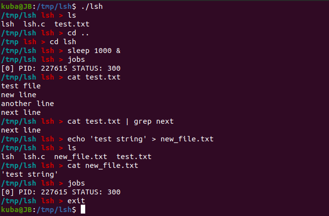

# Powłoka systemowa LiteShell

Prosta wersja powłoki zaimplementowana w języku **C**. Za jej pomocą można poruszać się po katalogach i uruchamiać programy. Dodatkowo **lsh** obsługuje potoki ( **|** )  oraz przekierowania ( **<, >, 2>** ). Istnieje również możliwość zarządzania zadaniami (polecenia: **jobs, fg, bg**).

Przykładowe uruchomienie:

